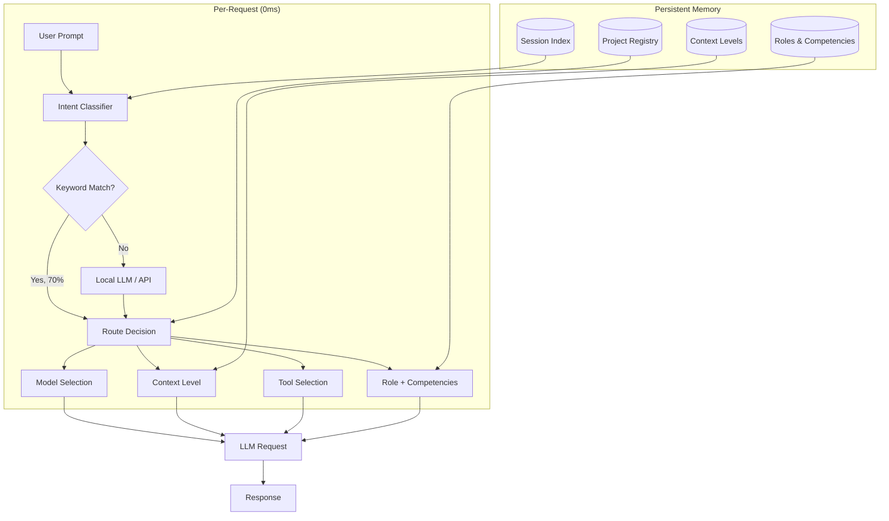

<div align="center">

# 0.flow

**Stateful IDE with Local Intelligence**

*The AI coding assistant that remembers your project, understands your intent, and routes decisions before the LLM even sees your prompt.*

[Architecture](#architecture) · [How It Works](#how-it-works) · [Comparison](#comparison) · [Status](#status)

</div>

---

## The Problem

Every AI coding tool today is **stateless**. You open a chat, explain context, get help, close the chat — and everything is lost. Next time you start from scratch.

- No memory between sessions
- No understanding of your project structure
- No role specialization
- Same expensive model for "hello" and "refactor the auth module"
- Full system prompt loaded for every request regardless of intent

## The Solution

**0.flow** combines two layers that no other tool has:

```
┌─────────────────────────────────────────────────────┐
│  Layer 1: Local Intent (0ms, per-request)           │
│  ─────────────────────────────────────────────────  │
│  • Classifies intent BEFORE sending to LLM          │
│  • Routes to optimal model (cost-aware)             │
│  • Selects context level (200 / 700 / 2000 tokens)  │
│  • Picks tools, role, reasoning mode                │
│  • Keyword: 0ms | Local LLM: 300ms | API: 500ms     │
└─────────────────────────────────────────────────────┘
         │
         ▼
┌─────────────────────────────────────────────────────┐
│  Layer 2: Persistent Memory (cross-session)         │
│  ─────────────────────────────────────────────────  │
│  • Sessions with structured context (L1/L2/L3)      │
│  • Roles & competencies (22 roles, 6-7 each)        │
│  • Decision history (append-only log)               │
│  • Orchestrators, child sessions, cross-project     │
│  • Semantic search across all history (5ms)         │
└─────────────────────────────────────────────────────┘
```

**Analogy**: Layer 1 is the cerebellum (instant reflexes). Layer 2 is long-term memory. Together — an agent that grows with your project.

## How It Works

```
User: "continue what we did yesterday"

  Intent (0ms): action=session_mgmt, target=last_session
  → DON'T send to LLM
  → Find last session (from memory)
  → Load context (500 tokens)
  → Show status
  → Next prompt already has yesterday's context

User: "ok, finish the tests"

  Intent (0ms): action=code, model=heavy, context=L2
  → System prompt: role=coder + dev workflow + session context
  → Model: DeepSeek Pro (reasoning=off, code task)
  → Tools: [readFile, writeFile, shell, grep]
  → Agent knows WHAT to test (from session context)
```

No manual context loading. No "let me explain the project again". The IDE already knows.

## Architecture



## Comparison

| | Cursor | Kiro | Copilot | **0.flow** |
|---|:---:|:---:|:---:|:---:|
| Cross-session memory | ❌ | ❌ | ❌ | ✅ |
| Roles & competencies | ❌ | ❌ | ❌ | ✅ |
| Dynamic system prompt | ❌ | partial | ❌ | ✅ |
| Local intent (0ms) | ❌ | ❌ | ❌ | ✅ |
| Auto model routing | ❌ | ❌ | ❌ | ✅ |
| Context level routing | ❌ | ❌ | ❌ | ✅ |
| Session orchestration | ❌ | ❌ | ❌ | ✅ |
| Semantic session search | ❌ | ❌ | ❌ | ✅ |
| Cost-aware decisions | ❌ | ❌ | ❌ | ✅ |
| Offline capable | ❌ | ❌ | ❌ | ✅ |

## Stack

- **IDE Shell**: Code OSS fork (Electron, patches over 1.107.1)
- **Extension**: TypeScript, SolidJS, Effect-TS, Bun
- **Intent Classifier**: Keyword (0ms) + Qwen3-0.6B GGUF (local) + API fallback
- **Embeddings**: MiniLM-L6-v2 (ONNX, 384 dims, in-process worker)
- **Vector Store**: LanceDB (embedded)
- **Models**: BYOK — DeepSeek, MiniMax, Claude, Qwen, local Ollama

## Status

| Component | Status |
|-----------|--------|
| IDE (Code OSS fork) | ✅ Working (Windows x64) |
| Extension (chat, tools, steering) | ✅ Working |
| Intent Classifier (multi-provider) | ✅ Working |
| Semantic Search (@codebase) | ✅ Working |
| Session Memory (0.agent) | ✅ Working (174+ sessions) |
| Model Routing (Auto mode) | ✅ Working |
| Linux / macOS | 📋 Planned |
| Public release | 📋 Planned |

---

<div align="center">

**Built with 0.flow** — this IDE develops itself.

</div>

---

<details>
<summary>🇷🇺 Русская версия</summary>

## 0.flow — Stateful IDE с локальным интеллектом

**AI-ассистент для разработки, который помнит ваш проект, понимает намерение и принимает решения ДО обращения к LLM.**

### Проблема

Все AI-инструменты для кода сегодня — stateless. Открыл чат, объяснил контекст, получил помощь, закрыл — всё потеряно. В следующий раз начинаешь с нуля.

### Решение

Два слоя которых нет ни у кого:

**Слой 1 — Локальный Intent (0ms, per-request):**
- Классифицирует намерение ДО отправки в LLM
- Выбирает оптимальную модель (с учётом стоимости)
- Определяет уровень контекста (200 / 700 / 2000 токенов)
- Подбирает tools, роль, режим reasoning

**Слой 2 — Долговременная память (cross-session):**
- Сессии со структурированным контекстом (L1/L2/L3)
- Роли и компетенции (22 роли, 6-7 компетенций каждая)
- История решений (append-only лог)
- Оркестраторы, дочерние сессии, cross-project
- Семантический поиск по всей истории (5ms)

**Аналогия**: Слой 1 = мозжечок (мгновенные рефлексы). Слой 2 = долговременная память. Вместе = агент который растёт вместе с проектом.

### Пример

```
Пользователь: "продолжи то что вчера делали"

  Intent (0ms): action=session_mgmt, target=last_session
  → НЕ отправлять в LLM
  → Найти последнюю сессию
  → Загрузить контекст (500 токенов)
  → Следующий промт уже с контекстом вчерашней работы

Пользователь: "ок, допиши тесты"

  Intent (0ms): action=code, model=heavy, context=L2
  → System prompt: role=coder + DEV_WORKFLOW + контекст сессии
  → Model: DeepSeek Pro
  → Агент знает ЧТО тестировать (из контекста сессии)
```

### Сравнение

| | Cursor | Kiro | Copilot | **0.flow** |
|---|:---:|:---:|:---:|:---:|
| Память между сессиями | ❌ | ❌ | ❌ | ✅ |
| Роли и компетенции | ❌ | ❌ | ❌ | ✅ |
| Динамический system prompt | ❌ | частично | ❌ | ✅ |
| Локальный intent (0ms) | ❌ | ❌ | ❌ | ✅ |
| Auto model routing | ❌ | ❌ | ❌ | ✅ |
| Оркестрация сессий | ❌ | ❌ | ❌ | ✅ |
| Семантический поиск | ❌ | ❌ | ❌ | ✅ |
| Работа offline | ❌ | ❌ | ❌ | ✅ |

### Статус

Рабочий прототип. Windows x64. 174+ сессий в production (self-hosted development).

**Собран с помощью 0.flow** — эта IDE разрабатывает сама себя.

</details>
