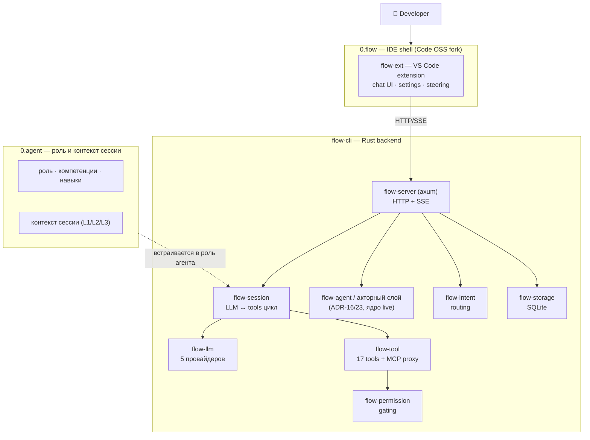

<div align="center">

# 0.flow

**Stateful AI IDE — агентская разработка в редакторе**

*AI-ассистент, который помнит ваш проект, классифицирует намерение и маршрутизирует запросы до дорогого LLM. Бэкенд — Rust, UI — VS Code extension, методология — отдельный слой.*

</div>

---

## Проблема

Многие AI-инструменты для кода хорошо отвечают на точечный запрос, но слабо держат контекст проекта между сессиями: его приходится объяснять заново, а структура проекта используется непоследовательно. Те, кто решает это «умным» поиском по всему коду, часто платят сложностью и стоимостью: RAG-слой с чанкингом и эмбеддингами, недетерминированный выбор кусков контекста, пересборка контекста от запроса к запросу.

0.flow пошёл иначе: не внешний поисковый слой поверх контекста, а знание, уже размеченное для загрузки (тема, триггер, уровень). Зачем это — в разделе ниже.

## Решение: структура = ретривал, а не RAG

0.flow не строит RAG-слой как заплатку от раздувания контекста. Знание в системе уже **семантически разбито для поиска**: у каждой единицы знания есть тема, триггер и уровень загрузки. Ретривал **вшит в структуру**, а не висит отдельным эмбеддинговым слоем поверх.

```
знание → структура (индексы, spec_refs, навыки с topics, L1/L2/L3)
   │  модель грузит ровно то, что нужно, по явной теме
   ▼
стабильный префикс → переиспользование KV-кэша
```

**Зачем это**: детерминизм. Структурный ретривал даёт стабильный контекст, а стабильный контекст даёт стабильный префикс — модель переиспользует KV-кэш, вместо того чтобы каждый раз пересчитывать всё. RAG, наоборот, вносит недетерминизм и ломает кэш.

**Честно про эмбеддинги**: они есть (ONNX), но используются не как первичный ретривал знания, а точечно, где фаззи-поиск реально нужен — поиск по коду и роутинг. Знание загружается структурно.

| Слой | Метод | Почему |
|------|-------|--------|
| знание (роли, спеки, навыки) | структурный ретривал | детерминизм + кэш |
| код, роутинг | эмбеддинги (ONNX) | фаззи-поиск, где нужен |

Экономия тут не «сделали бесплатно», а **«не строили то, что не нужно»**: без чанкинга, без отдельного ретривал-слоя, без налога на инфраструктуру. Это zero-cost подход к контексту: одна LLM, никакого дообучения и внешнего RAG.

А вокруг — экосистема из четырёх компонентов, работающих как одно целое:

```
┌──────────────────────────────────────────────────────┐
│  0.flow — IDE shell (Code OSS fork, Electron)        │
│    └─ flow-ext — VS Code extension (TypeScript)      │  ← UI: чат, tools, steering
│    └─ flow-cli — Rust backend (binary)               │  ← ядро: LLM, tools, MCP
│         └─ читает роль и контекст сессии из 0.agent  │  ← контекст агента
└──────────────────────────────────────────────────────┘
```

| Компонент | Роль | Технология |
|-----------|------|-----------|
| **0.flow** | IDE shell (контейнер) | Code OSS fork, Electron, patches |
| **flow-ext** | VS Code extension — UI-слой | TypeScript, SolidJS, Bun, HTTP/SSE |
| **flow-cli** | Rust backend — ядро | Rust, axum, tokio, SSE |
| **0.agent** | мета-слой / центр методологии | роли, сессии, правила, компетенции |

Конечный пользователь работает в 0.flow (или любом VS Code с flow-ext). Под капотом: extension (flow-ext) → Rust backend (flow-cli), а поверх — мета-слой 0.agent, который задаёт правила работы агентов.



## flow-cli — Rust backend

Замена kilo.exe (Bun/TypeScript, ~140 MB) на компактный Rust binary.

Единый binary, несколько transport-режимов:
- `serve` — HTTP/SSE (для extension)
- `chat` — TUI (терминальный агент)
- `pipe` — stdin/stdout JSON (CI/CD, headless)
- `acp` — JSON-RPC (JetBrains, Zed)

Внутри — 16 crates, слоями:

```
TRANSPORT:      flow-server (axum) · flow-cli-lib (TUI/pipe)
ORCHESTRATION:  flow-session (LLM↔tools) · flow-agent (registry/routing)
CAPABILITIES:   flow-llm (5 провайдеров) · flow-tool (17 tools + MCP proxy)
                flow-mcp · flow-pty
SERVICES:       flow-bus · flow-storage (SQLite) · flow-permission
                flow-config · flow-vault (AES-256-GCM) · flow-search (ONNX) · flow-intent
FOUNDATION:     flow-core (types, traits, errors)
```

Ключевое: **LLM streaming (SSE), 5 провайдеров, 17 tools + MCP-прокси, permission-gated исполнение, intent-классификатор для маршрутизации модели**.

## flow-ext — VS Code extension

Чистый VS Code extension (без наследия Kilo Code / Effect.ts / Kilo SDK). UI-слой над flow-cli:
- Chat UI (SolidJS webview) — разговор с LLM через flow-cli
- Settings — провайдеры, модели, steering
- Terminal — PTY bridge через flow-cli
- Session management — история, поиск, навигация
- Cost tracking — учёт использования

## Метрики (актуальные, продукт)

| Домен | Показатель | Источник |
|-------|-----------|----------|
| **flow-cli Radar** | **8.49/10** (32 компонента, 0🔴, 109🟢) | radar INDEX v57, 2026-09-05 |
| **flow-cli тесты** | ~1157 (unit ~1061 + int 68 + proptest 28) | radar v57 (Test Infrastructure) |
| **Акторный слой (live)** | 33/33 PASS, 0 SIDE_BUG | live-валидация R146-R148 |
| **flow-ext Radar** | ~8.70 mean (41 активных, 🔴 0) | flow-ext-radar v6, R131 refresh |
| **flow-ext top** | Connection 9.40 · SSE 9.30 · Preloader 9.25 | flow-ext-radar v6 |

## 0.agent — мета-слой / центр методологии

0.agent — это не рантайм, а **центр**: правила, роли, сессии, компетенции, по которым работают агенты. Методологический слой, который задаёт дисциплину поверх любого движка.

## Направление: акторная модель (ADR-16/23, ядро live)

Координация агентов — это направление развития, и его **ядро доведено до работающего live-состояния** в flow-cli (Actor Runtime radar 9.0/10):
- Акторы создаются из **образов** (двухуровневый core+state) + портабельный дамп save/load_image.
- Акторы **живут**: Lifecycle FSM, promote/wake, spawn.
- Акторы **общаются** через Inbox (REST) + slash-команды.
- Live-валидация: **33/33 PASS, 0 SIDE_BUG**.

Это реализовано как часть движка (flow-cli) и live-валидировано; как готовый пользовательский продукт/рантайм поверх IDE — ещё направление.

## Чем это отличается

- **Не «использую фреймворк», а спроектировано как исследование.** Акторная модель — авторская, harness собран с оглядкой на существующие подходы (в т.ч. Kiro.dev как референс), но как собственная архитектура, не форк.
- **Rust-ядро + чистый TS-extension**, без вендор-лока и наследия.
- **Методология отделена от движка** (0.agent) — работает поверх любого бэкенда.

## Стек

- **IDE Shell**: Code OSS fork (Electron, patches over 1.107.1)
- **Extension (flow-ext)**: TypeScript, SolidJS, Bun
- **Backend (flow-cli)**: Rust, axum, tokio, rusqlite, rmcp, ring
- **Мета-слой (0.agent)**: роли/компетенции/навыки, сессии, правила
- **AI**: BYOK (5 облачных: Anthropic, OpenAI, Gemini, Azure, Bedrock) + локальный Ollama

## Статус

| Компонент | Статус |
|-----------|--------|
| 0.flow (IDE shell) | ✅ Working (Windows x64) |
| flow-cli (Rust backend) | ✅ Working |
| flow-ext (extension) | ✅ Working |
| 0.agent (мета-слой) | ✅ Working |
| Акторная модель (ADR-16/23) | ✅ Ядро live · продукт-рантайм — направление |
| Linux / macOS | 📋 Planned |
| Public release | 📋 Planned |

---

<div align="center">

**Built with 0.flow**

</div>
